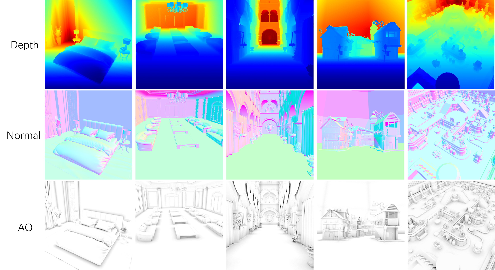

# DeepAo: Efficient Screen Space Ambient Occlusion Generation via Deep Network
This is the codes of the [DeepAO](https://ieeexplore.ieee.org/document/9052668) paper.

## Dataset Sample Visualization


## Dataset Generation Pipline  
We use 3dsMax with VRay engine to create our dataset. Each labeled data of our AO dataset contains the AO map and its corresponding depth map and normal map. 
You can build your own dataset by the steps as follows:   
1. Build or collect your own 3D scenes. You can get 3D material from [Free3d](https://free3d.com/zh/?__cf_chl_captcha_tk__=de16bd0727a079082c4c7c81bae2e15d16fb5fb9-1587184515-0-AbhP8f7FreGGyussw_P5ZZT-4NMkKXy6WY4tHAbts9CK-Xi-X-cwEBMTpZwo0n099A7FZiqv1OwzTvXf9oAs5swy0eG-ZHeH66MprcCtesmypmZ1MmIwWlPJc5iQMfc21AhD9xhd3zUUCBzDK37QHM92Xju3xRpwpLcpDBmldcD2RtRKVQVX6InO3Md9_lq4FTqAaYfJgE5az3oQZI5r3IDJ-rUMoQ8E3XpJmh4uVohqqZ_Spj7hgbLFVuJrSjypJFiXuyZVic4nXMjTfZgEYpzzUPrhQH_B8v03KCtVtNu7U_Y49t0BkSLQZOPL5rhu8DOUTj4lkMqddFf6uYzA-o1g2T0LxTeQQC3UV7viUMyFdCGH2CgZ8GE41CfAy1aLKg).  
2. Configure the VRay engine.  
  + AO map: Configure the VRay engine according to the instructions [here](http://www.laurenscorijn.com/articles/ambient-occlusion-baking)  for baking Ambient Occlusion Map (Method 4 or 5, depending on your requirments).  
  + Position map: We recommend to use VRaySamplerInfo instead of VrayZDepth, because the depth value obtained by VrayZDepth is nonlinear. You can get the xyz coordinates of each point from VRaySamplerInfo. In our work, we only used Z coordinates(Z depth) in the experiments.   
  + Normal map: You can use VRaySamplerInfo or VRayNormals. VRaySamplerInfo can generate normal in camera space and world space. VRayNormals can only generate normal in camera space. We used normal in camera space in our work.  
  
3. Plan the shooting paths and bind it to the camera.  
4. Use the Batch Rendering operation to render the scenes.     

## Citation 
Please cite [our work](https://ieeexplore.ieee.org/document/9052668) if you use DeepAO.

```
@ARTICLE{DeepAO2020,
	author={D. {Zhang} and C. {Xian} and G. {Luo} and Y. {Xiong} and C. {Han}}, 
	journal={IEEE Access}, 
	title={DeepAO: Efficient Screen Space Ambient Occlusion Generation via Deep Network}, 
	year={2020}, 
	volume={8}, 
	number={1}, 
	pages={64434-64441}
}
```
